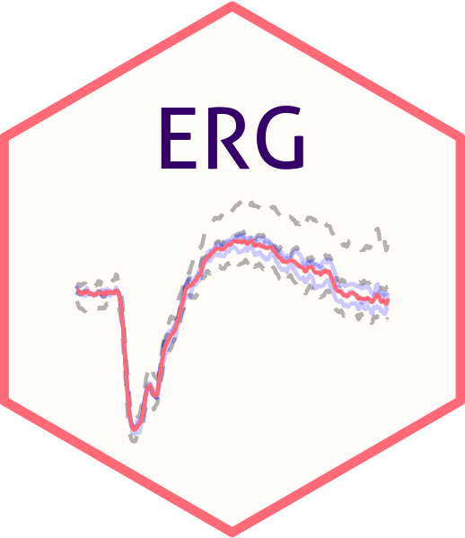

<!-- README.md is generated from README.Rmd. Please edit that file -->

```{r, include = FALSE}
knitr::opts_chunk$set(
  collapse = TRUE,
  comment = "#>",
  fig.path = "man/figures/README-",
  out.width = "100%"
)
```


# ERG 

<!-- badges: start -->
<!-- badges: end -->

The R package ERG provides tools to (1.) detrend ERG data, (2.) remove outlier traces, (3.) average traces, (4.) detect peaks and (5.) fit summary functions (e.g., Naka-Rushton function).

### Contact

Maximilian Pfau, MD: [maximilian.pfau@iob.ch](maximilian.pfau@iob.ch)

Brett Jeffrey, Ph.D.: [brett.jeffrey@nih.gov](brett.jeffrey@nih.gov)


## Installation

You can install the development version of ERG from [GitHub](https://github.com/) with:

``` r
# install.packages("devtools")
devtools::install_github("maximilianpfau/ERG")
```

## Example for scotopic ERGs

This is a basic example which shows you how to solve a common problem:

```{r example}
library(ERG)
library(tidyverse)

# Visualize the native data

scotErgExample %>%
  filter(DOE=="2016-03-30") %>%
  ggplot(aes(x=time, y=signal, group=traceID)) + geom_line(alpha=0.2) +
  facet_wrap(~intensity) +
  xlim(-20,250) + theme_bw() +
  xlab("Time [ms]") + ylab("Amp. [uV]")
  
# Visualize the de-trended data, averaged data (blue lines), and the identified peaks

scotDataFitted <- scotErgExample %>%
  filter(time < 250) %>%
  ERG::detrend(.) %>%
  ERG::avgTraces(.)

scotDataFitted <- scotDataFitted  %>%
  ERG::scotPeakFinder(.)
  
scotDataFitted %>%
  filter(DOE=="2016-03-30") %>%
  ggplot(aes(x=time, y=(signal-.fitted), group=traceID)) + geom_line(alpha=0.2) +
  geom_line(aes(x=time, y=meanSignal), color="blue") +
  geom_point(aes(x=awave_peak_time, y=awave_amp), color="red") +
  geom_point(aes(x=bwave_peak_time, y=bwave_to_iso_amp), color="green") +
  facet_wrap(~intensity) +
  xlim(-20,250) + theme_bw() +
  xlab("Time [ms]") + ylab("Amp. [uV]")

```


## Please note

The algorithm will always detect peaks. A filter function is required to exclude spurious peaks (usually based on small amplitudes). 

