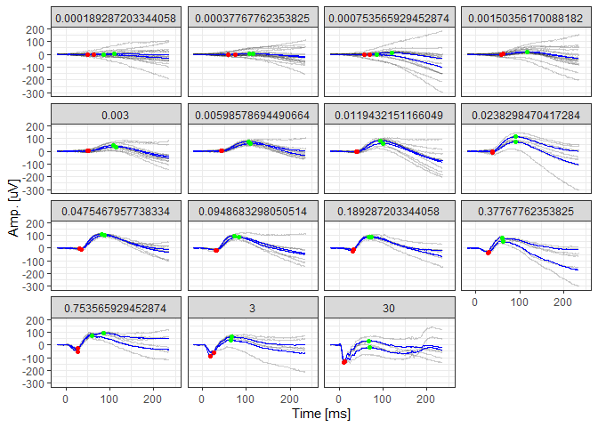

<!-- README.md is generated from README.Rmd. Please edit that file -->

# ERG 

<!-- badges: start -->
<!-- badges: end -->

The R package ERG provides tools to (1.) detrend ERG data, (2.) remove
outlier traces, (3.) average traces, (4.) detect peaks and (5.) fit
summary functions (e.g., Naka-Rushton function).

### Contact

Maximilian Pfau, MD: [maximilian.pfau@iob.ch](maximilian.pfau@iob.ch)

Brett Jeffrey, Ph.D.: [brett.jeffrey@nih.gov](brett.jeffrey@nih.gov)

## Installation

You can install the development version of ERG from
[GitHub](https://github.com/) with:

``` r
# install.packages("devtools")
devtools::install_github("maximilianpfau/ERG")
```

## Example for scotopic ERGs

This is a basic example which shows you how to solve a common problem:

``` r
library(ERG)
library(tidyverse)
#> ── Attaching core tidyverse packages ──────────────────────── tidyverse 2.0.0 ──
#> ✔ dplyr     1.1.1     ✔ readr     2.1.4
#> ✔ forcats   1.0.0     ✔ stringr   1.5.0
#> ✔ ggplot2   3.4.2     ✔ tibble    3.2.1
#> ✔ lubridate 1.9.2     ✔ tidyr     1.3.0
#> ✔ purrr     1.0.1     
#> ── Conflicts ────────────────────────────────────────── tidyverse_conflicts() ──
#> ✖ dplyr::filter() masks stats::filter()
#> ✖ dplyr::lag()    masks stats::lag()
#> ℹ Use the conflicted package (<http://conflicted.r-lib.org/>) to force all conflicts to become errors

# Visualize the native data

scotErgExample %>%
  filter(DOE=="2016-03-30") %>%
  ggplot(aes(x=time, y=signal, group=traceID)) + geom_line(alpha=0.2) +
  facet_wrap(~intensity) +
  xlim(-20,250) + theme_bw() +
  xlab("Time [ms]") + ylab("Amp. [uV]")
```


``` r
  
# Visualize the de-trended data, averaged data (blue lines), and the identified peaks

scotDataFitted <- scotErgExample %>%
  filter(time < 250) %>%
  ERG::detrend(.) %>%
  ERG::avgTraces(.)
#> Joining with `by = join_by(traceID, time)`
#> Joining with `by = join_by(DOE, recording, time)`

scotDataFitted <- scotDataFitted  %>%
  ERG::scotPeakFinder(.)
#> Joining with `by = join_by(traceID)`
#> Joining with `by = join_by(traceID)`
#> Joining with `by = join_by(traceID)`
#> Joining with `by = join_by(traceID)`
#> Joining with `by = join_by(traceID)`
#> Joining with `by = join_by(traceID)`
#> Joining with `by = join_by(traceID)`
#> Joining with `by = join_by(traceID)`
  
scotDataFitted %>%
  filter(DOE=="2016-03-30") %>%
  ggplot(aes(x=time, y=(signal-.fitted), group=traceID)) + geom_line(alpha=0.2) +
  geom_line(aes(x=time, y=meanSignal), color="blue") +
  geom_point(aes(x=awave_peak_time, y=awave_amp), color="red") +
  geom_point(aes(x=bwave_peak_time, y=bwave_to_iso_amp), color="green") +
  facet_wrap(~intensity) +
  xlim(-20,250) + theme_bw() +
  xlab("Time [ms]") + ylab("Amp. [uV]")
```



## Please note

The algorithm will always detect peaks. A filter function is required to
exclude spurious peaks (usually based on small amplitudes).
